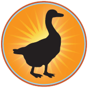

# Лабораторная работа №1
## Создание простой веб-страницы на HTML

---

## Цель работы

Научиться создавать базовую HTML-страницу: вводить текстовое содержимое, задавать структуру HTML-документа, разметить текстовые элементы и добавить изображение и стилевое оформление с помощью CSS.

---

## Теоретические сведения

### Что игнорирует браузер

При отображении HTML-документа браузер игнорирует следующее:

- **Множественные пробелы** — несколько последовательных пробелов отображаются как один.
- **Переносы строк** — переводы строк преобразуются в пробелы и не влияют на форматирование.
- **Табуляция** — табы также преобразуются в пробелы.
- **Нераспознанные теги** — браузер пропускает теги, которых не понимает.
- **Текст в комментариях** — содержимое между `<!--` и `-->` не отображается.

### Анатомия HTML-элемента

HTML-элемент состоит из **открывающего тега**, **содержимого** и **закрывающего тега**:

```html
<elementname>Содержимое здесь</elementname>
```

Пример:

```html
<h1>Black Goose Bistro</h1>
```

- **Тег** — имя элемента в угловых скобках `< >`.
- **Открывающий тег** (start tag) — начало элемента.
- **Закрывающий тег** (end tag) — конец элемента, начинается с косой черты `/`.
- **Разметка (markup)** — теги, добавленные вокруг содержимого.

> **Важно:** в HTML регистр имён элементов не важен, однако принято писать их строчными буквами.

### Минимальная структура HTML-документа

```html
<!DOCTYPE html>
<html>
  <head>
    <meta charset="utf-8">
    <title>Заголовок страницы</title>
  </head>
  <body>
    Содержимое страницы.
  </body>
</html>
```

| Элемент | Назначение |
|---|---|
| `<!DOCTYPE html>` | Объявление типа документа — указывает браузеру, что документ написан на HTML5 |
| `<html>` | Корневой элемент, содержит весь документ |
| `<head>` | Метаданные документа: заголовок, кодировка, стили, скрипты |
| `<meta charset="utf-8">` | Задаёт кодировку символов UTF-8 |
| `<title>` | Обязательный элемент — заголовок вкладки и закладки |
| `<body>` | Видимое содержимое страницы |

### Семантическая разметка

Цель HTML — добавить **смысл и структуру** содержимому, а не описывать его внешний вид. При разметке нужно выбирать тот элемент, который наиболее точно описывает содержимое.

Структура документа образует **DOM (Document Object Model)** — иерархию элементов, которую браузер использует для отображения и которую CSS и JavaScript используют для оформления и поведения.

### Блочные и строчные элементы

- **Блочные элементы** (`h1`, `h2`, `p` и др.) — начинаются с новой строки, занимают всю ширину, образуют «прямоугольные блоки» на странице.
- **Строчные элементы** (`em` и др.) — не начинают новую строку, встраиваются в поток текста.

### Пустые элементы

Некоторые элементы не имеют содержимого — они выполняют простую директиву. Например:

- `` — вставляет изображение
- `<br>` — перенос строки
- `<hr>` — горизонтальная линия
- `<meta>` — метаданные документа

### Атрибуты

**Атрибуты** — инструкции, уточняющие или изменяющие элемент. Они указываются в открывающем теге:

```html

```

Правила использования атрибутов:

- Атрибуты указываются только в открывающем теге.
- Несколько атрибутов разделяются пробелами, порядок не важен.
- Значение атрибута заключается в прямые кавычки `"значение"`.
- Имена и значения атрибутов определены спецификацией HTML — их нельзя придумывать самостоятельно.
- Некоторые атрибуты обязательны, например `src` и `alt` у элемента `img`.

### Соглашения об именовании файлов

- Используйте правильные расширения: `.html` или `.htm` для HTML-файлов, `.gif`, `.png`, `.jpg`, `.svg` для графики.
- Не используйте пробелы в именах файлов — разделяйте слова дефисом или подчёркиванием.
- Избегайте специальных символов: `?`, `%`, `#`, `/`, `:`, `;` и др.
- Имена файлов могут быть чувствительны к регистру — рекомендуется использовать строчные буквы.
- Делайте имена файлов короткими.

---

## Задание

Выполните следующие упражнения последовательно.

---

### Упражнение 1. Ввод содержимого

**Задача:** создать HTML-файл с текстовым содержимым и сохранить его в новой папке.

1. Откройте текстовый редактор и создайте новый документ.

2. Введите следующий текст точно так, как показано ниже, сохраняя переносы строк:

```
Black Goose Bistro

The Restaurant
The Black Goose Bistro offers casual lunch and dinner fare in a relaxed
atmosphere. The menu changes regularly to highlight the freshest local
ingredients.

Catering
You have fun. We'll handle the cooking. Black Goose Catering can handle
events from snacks for a meetup to elegant corporate fundraisers.

Location and Hours
Seekonk, Massachusetts;
Monday through Thursday 11am to 9pm; Friday and Saturday, 11am to
midnight
```

3. Сохраните файл:
   - Через меню «Файл» → «Сохранить как» создайте новую папку с именем **`bistro`**.
   - Сохраните файл под именем **`index.html`** в эту папку.
   - Имя файла обязательно должно заканчиваться на `.html`.

4. Откройте файл `index.html` в браузере и посмотрите на результат.

**Вопрос для размышления:** Почему весь текст отображается слитно в одну строку, хотя вы вводили его с переносами?

---

### Упражнение 2. Добавление минимальной структуры HTML

**Задача:** добавить обязательные структурные теги HTML-документа.

1. Откройте файл `index.html` в текстовом редакторе.

2. В самое начало файла добавьте объявление DOCTYPE:

```html
<!DOCTYPE html>
```

3. Оберните весь документ в корневой элемент `<html>`:
   - Добавьте `<html>` после DOCTYPE.
   - Добавьте `</html>` в самый конец файла.

4. Создайте раздел `<head>` перед текстовым содержимым. Внутри него укажите кодировку и заголовок страницы:

```html
<head>
  <meta charset="utf-8">
  <title>Black Goose Bistro</title>
</head>
```

5. Оберните текстовое содержимое в элемент `<body>`. Готовый документ должен выглядеть так:

```html
<!DOCTYPE html>
<html>

<head>
  <meta charset="utf-8">
  <title>Black Goose Bistro</title>
</head>

<body>
Black Goose Bistro

The Restaurant
The Black Goose Bistro offers casual lunch and dinner fare in a relaxed
atmosphere. The menu changes regularly to highlight the freshest local
ingredients.

Catering
You have fun. We'll handle the cooking. Black Goose Catering can handle
events from snacks for a meetup to elegant corporate fundraisers.

Location and Hours
Seekonk, Massachusetts;
Monday through Thursday 11am to 9pm; Friday and Saturday, 11am to
midnight
</body>

</html>
```

6. Сохраните файл, перезагрузите страницу в браузере.

**Что изменилось?** Теперь в заголовке вкладки браузера отображается название «Black Goose Bistro». Текст по-прежнему идёт сплошным потоком — в следующем упражнении мы это исправим.

---

### Упражнение 3. Разметка текстовых элементов

**Задача:** добавить семантическую разметку заголовков, абзацев и выделения текста.

1. Откройте файл `index.html`.

2. Разметьте первую строку «Black Goose Bistro» как заголовок первого уровня:

```html
<h1>Black Goose Bistro</h1>
```

3. Разметьте три подзаголовка («The Restaurant», «Catering», «Location and Hours») как заголовки второго уровня. Первый показан ниже — остальные сделайте самостоятельно:

```html
<h2>The Restaurant</h2>
```

4. Разметьте абзацы текста элементом `<p>`. Первый показан ниже — остальные сделайте самостоятельно:

```html
<p>The Black Goose Bistro offers casual lunch and dinner fare in a relaxed
atmosphere. The menu changes regularly to highlight the freshest local
ingredients.</p>
```

5. В разделе «Catering» выделите фразу «We'll handle the cooking.» с помощью элемента `<em>`:

```html
<p>You have fun. <em>We'll handle the cooking.</em> Black Goose Catering can handle
events from snacks for a meetup to elegant corporate fundraisers.</p>
```

6. Сохраните файл и обновите страницу в браузере. Теперь содержимое должно отображаться структурированно с заголовками и абзацами.

**Обратите внимание:**
- Элементы `h1`, `h2`, `p` — **блочные**: каждый начинается с новой строки.
- Элемент `em` — **строчный**: он встраивается в текст абзаца, не разрывая его.

---

### Упражнение 4. Добавление изображения

**Задача:** вставить логотип на страницу с помощью пустого элемента `img` и его атрибутов.

1. Скачайте файл изображения `blackgoose.png` с сайта [learningwebdesign.com/5e/materials/ch04/bistro](http://learningwebdesign.com/5e/materials/ch04/bistro) (щёлкните правой кнопкой мыши по изображению → «Сохранить изображение как»). Сохраните его в папку **`bistro`** рядом с файлом `index.html`.

2. Вставьте изображение в начало заголовка `h1`, добавив элемент `` с обязательными атрибутами `src` и `alt`:

```html
<h1>Black Goose Bistro</h1>
```

3. Чтобы изображение отображалось над текстом заголовка, добавьте перенос строки `<br>` после тега ``:

```html
<h1><br>Black Goose Bistro</h1>
```

4. В блоке «Location and Hours» разбейте текст адреса на отдельные строки с помощью тегов `<br>` в нужных местах.

5. Сохраните файл и обновите браузер.

**Если изображение не отображается:** убедитесь, что файл `blackgoose.png` находится в той же папке `bistro`, что и `index.html`, и что в атрибуте `src` имя файла написано точно так же.

---

### Упражнение 5. Добавление стилей CSS

**Задача:** изменить внешний вид страницы с помощью встроенной таблицы стилей.

1. Откройте файл `index.html`.

2. Внутри элемента `<head>` добавьте элемент `<style>` после тега `<title>`:

```html
<head>
  <meta charset="utf-8">
  <title>Black Goose Bistro</title>
  <style>

  </style>
</head>
```

3. Внутри элемента `<style>` введите следующие правила CSS:

```css
body {
  background-color: #faf2e4;
  margin: 0 10%;
  font-family: sans-serif;
}
h1 {
  text-align: center;
  font-family: serif;
  font-weight: normal;
  text-transform: uppercase;
  border-bottom: 1px solid #57b1dc;
  margin-top: 30px;
}
h2 {
  color: #d1633c;
  font-size: 1em;
}
```

4. Сохраните файл и откройте (или обновите) страницу в браузере.

**Если страница не изменила вид:** проверьте, не пропущены ли точка с запятой `;` в конце правил или фигурные скобки `{ }`.

---

## Итоговый вид файла index.html

После выполнения всех упражнений ваш файл `index.html` должен содержать:

```html
<!DOCTYPE html>
<html>

<head>
  <meta charset="utf-8">
  <title>Black Goose Bistro</title>
  <style>
    body {
      background-color: #faf2e4;
      margin: 0 10%;
      font-family: sans-serif;
    }
    h1 {
      text-align: center;
      font-family: serif;
      font-weight: normal;
      text-transform: uppercase;
      border-bottom: 1px solid #57b1dc;
      margin-top: 30px;
    }
    h2 {
      color: #d1633c;
      font-size: 1em;
    }
  </style>
</head>

<body>

<h1><br>Black Goose Bistro</h1>

<h2>The Restaurant</h2>
<p>The Black Goose Bistro offers casual lunch and dinner fare in a relaxed
atmosphere. The menu changes regularly to highlight the freshest local
ingredients.</p>

<h2>Catering</h2>
<p>You have fun. <em>We'll handle the cooking.</em> Black Goose Catering can handle
events from snacks for a meetup to elegant corporate fundraisers.</p>

<h2>Location and Hours</h2>
<p>Seekonk, Massachusetts;<br>
Monday through Thursday 11am to 9pm;<br>
Friday and Saturday, 11am to midnight</p>

</body>
</html>
```

---

## Контрольные вопросы

1. Что такое DOCTYPE и зачем он нужен?
2. Чем отличается элемент `<head>` от элемента `<body>`?
3. Почему браузер игнорирует переносы строк из исходного документа?
4. В чём разница между блочными и строчными элементами? Приведите примеры.
5. Что такое пустой элемент? Какие пустые элементы вы использовали в работе?
6. Что такое атрибут? Какие атрибуты обязательны для элемента ``?
7. Где размещается элемент `<style>` и для чего он предназначен?
8. Что такое семантическая разметка и почему её важно соблюдать?

---

## Требования к отчёту

Отчёт должен содержать:

1. Цель работы.
2. Скриншоты страницы после каждого из пяти упражнений.
3. Итоговый исходный код файла `index.html`.
4. Ответы на контрольные вопросы.
5. Выводы по работе.
