# Лабораторная работа 3: Сочетание изображений и ссылок

## Подготовка
1. Создайте новую папку с названием `lab4`
2. Вставьте все файлы  из предыдущей лабораторной работы (лабораторная работа 3) в только что созданную папку `lab4`
3. Откройте папку `lab4` с помощью `vscode`
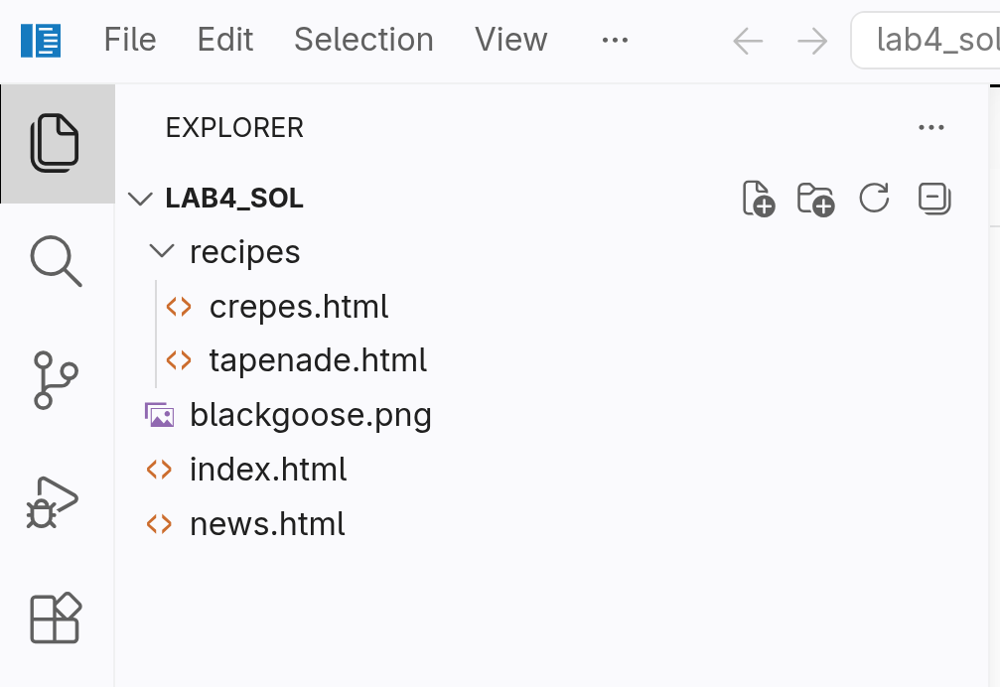
4. Создайте новую папку с названием `imgs` и переместите изображение `goose.png` в новую папку. **Измените атрибут `src` у элемента `img` на странице `index.html`, чтобы изображение отображалось корректно.**
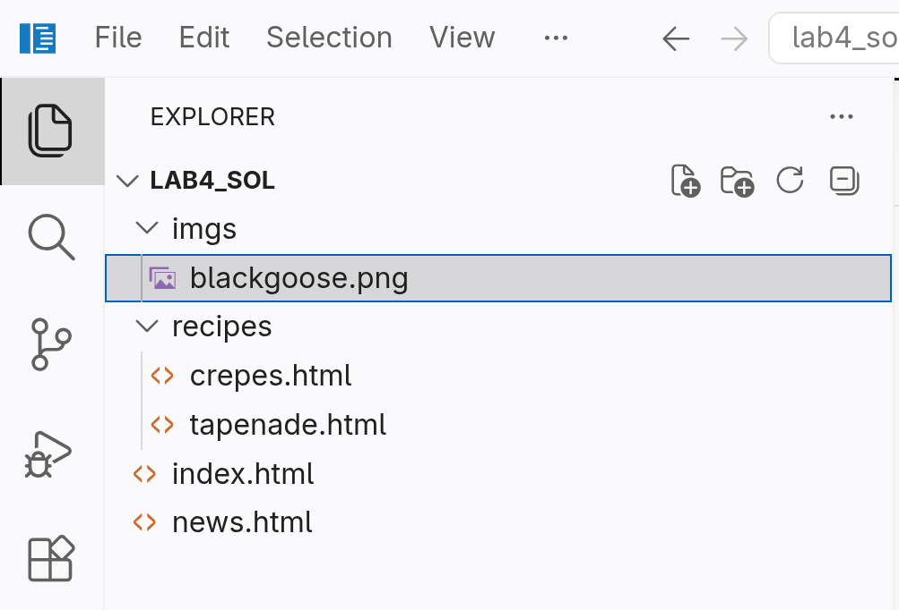
5. Распакуйте файл `gallery.zip` и поместите полученную папку (**а не сам zip-файл**) в папку `lab4`.
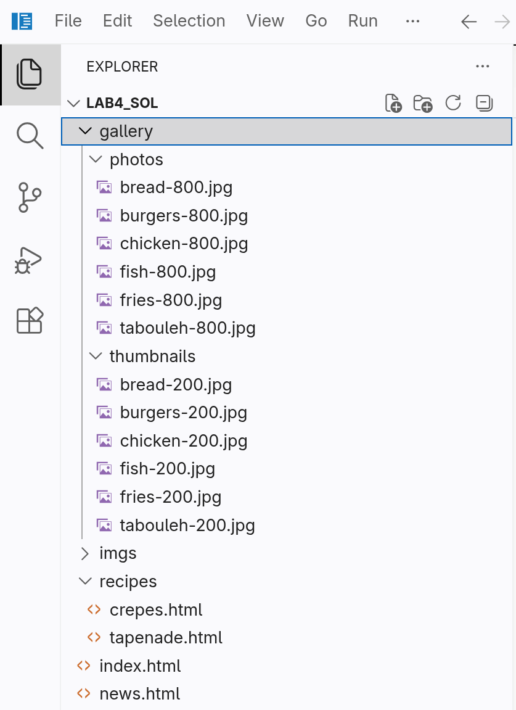
6. Создайте новую папку с названием `menu` и переместите в неё три предоставленных HTML-файла: `bread.html`, `burgers.html` и `fish.html`.
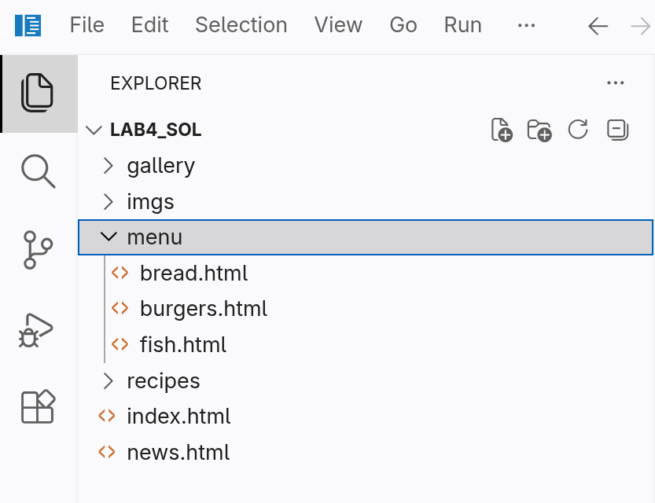
7. Наконец, переместите файл `menu.html` в папку `lab4`.

---

## Основная цель
В этом упражнении вы добавите на страницы изображения и превратите их в ссылки. Все необходимые полноразмерные фотографии и миниатюры (уменьшенные копии изображений) уже подготовлены, а я также заранее создал для вас HTML-файлы с базовым оформлением. Этот небольшой сайт состоит из исходной страницы (`menu.html`) и трех отдельных HTML-документов, на каждом из которых размещено полноразмерное изображение. Сначала мы добавим миниатюры, затем разместим полноразмерные версии изображений на соответствующих страницах, а в завершение настроим ссылки так, чтобы миниатюры вели на эти страницы.

---

## Инструкции

1. Откройте файл `menu.html` и добавьте на страницу небольшие миниатюры изображений, чтобы дополнить текст. Первую я уже добавил за вас:

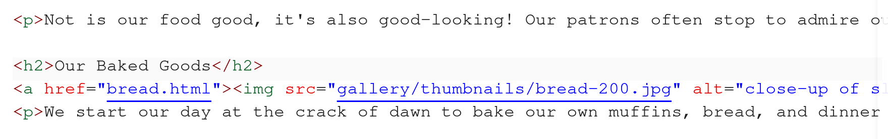

Я разместил изображение в начале абзаца, сразу после открывающего тега `
`. Поскольку все миниатюры находятся в папке `gallery/thumbnails`, я указал соответствующий путь в URL. Я добавил описание изображения с помощью атрибута `alt`, а так как знаю, что эти миниатюры будут отображаться с размером 200 на 200 пикселей на всех устройствах, я также включил атрибуты `width` и `height`, чтобы браузер понимал, сколько места нужно зарезервировать в макете. Теперь ваша очередь.

Добавьте миниатюры burgers-200.jpg и fish-200.jpg в начало абзацев соответствующих разделов, следуя моему примеру. Обязательно укажите пути к файлам и добавьте продуманные альтернативные описания (атрибут alt). Наконец, добавьте перенос строки (` `) после элемента img.

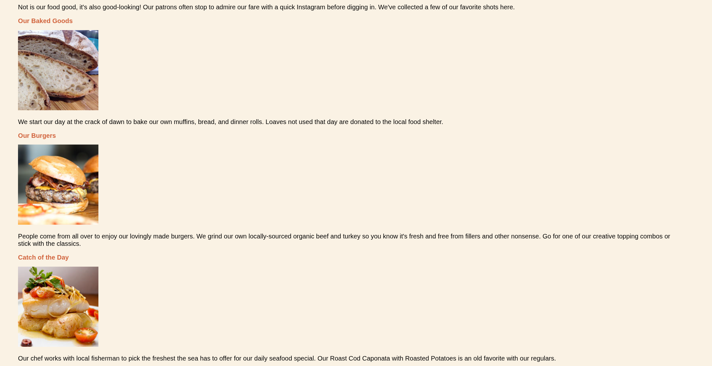

2. Добавьте правильную ссылку на страницу `menu`, чтобы на неё можно было перейти как с других страниц, так и с неё самой.

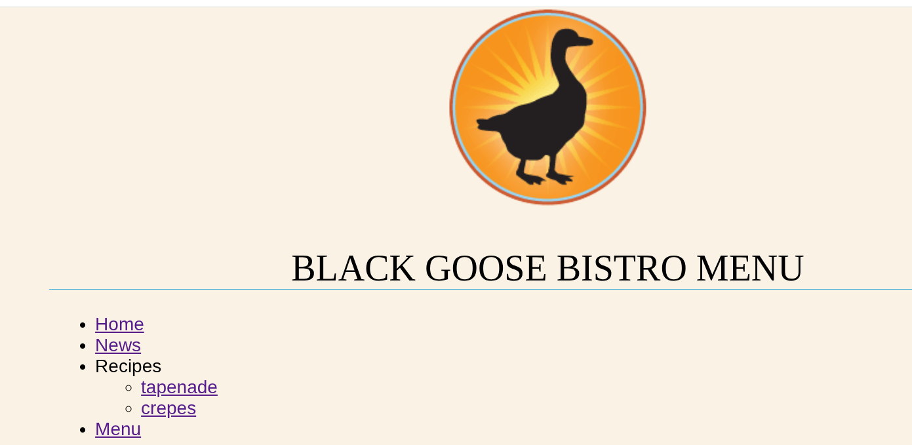

3. Теперь добавьте изображения в отдельные HTML-документы. Файл `bread.html` я уже подготовил для вас:

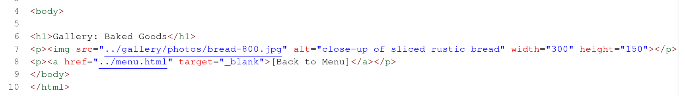

Обратите внимание, что полноразмерные изображения находятся в папке с названием `gallery/photos`, поэтому это необходимо учесть в путях к файлам. Также заметьте: поскольку эта страница не является адаптивной, а изображения будут иметь фиксированный размер на любых устройствах, я добавил здесь атрибуты ширины и высоты.

Добавьте изображения в файлы `burgers.html` и `fish.html`, следуя моему примеру. Подсказка: все изображения имеют ширину 800 пикселей и высоту 600 пикселей.

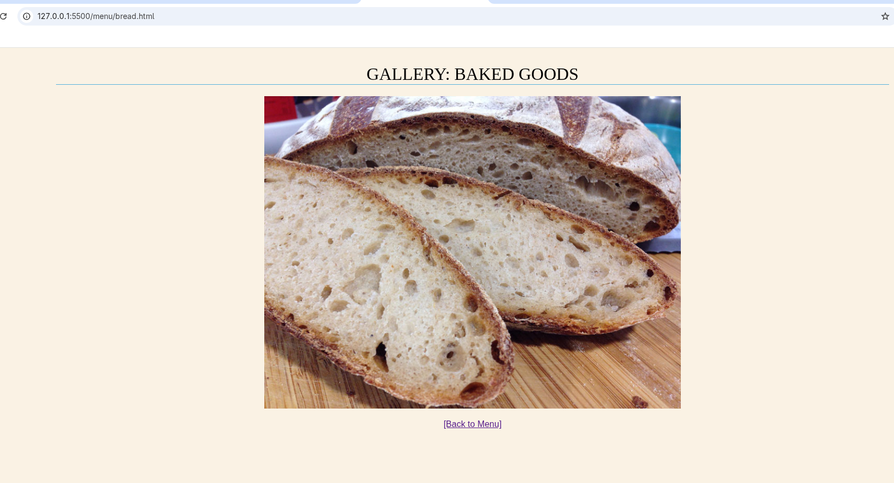
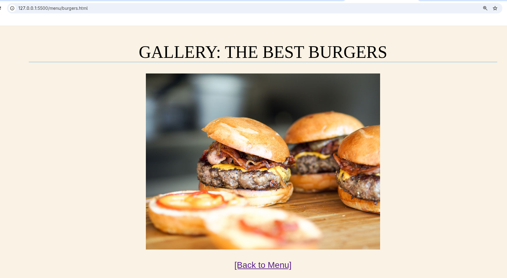
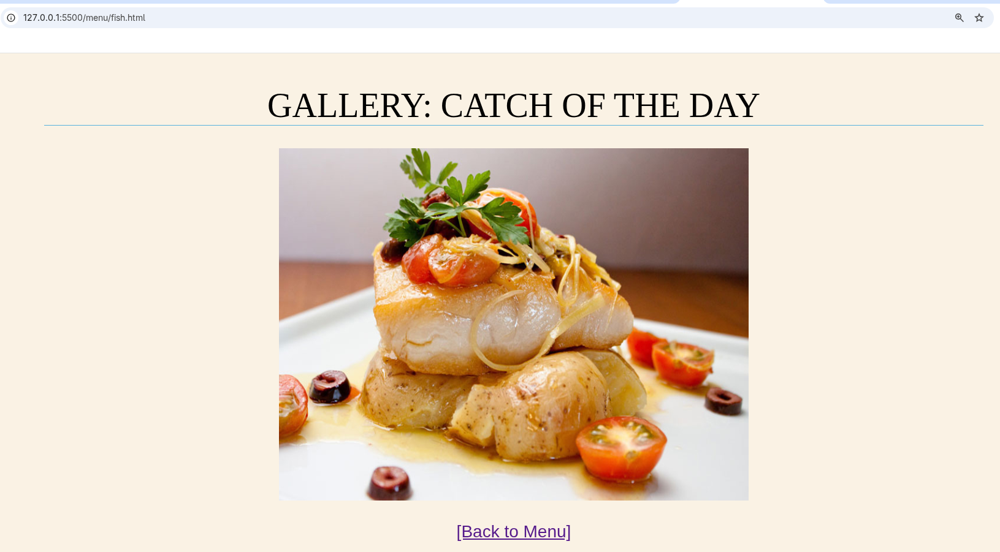

3. Внесите необходимые изменения, чтобы все ссылки на каждой странице работали корректно. **Обратите внимание, что файл `crepes.html` не предоставляется, так как он является примером; вместо него вы должны использовать собственный аналогичный файл из предыдущей лабораторной работы.**
